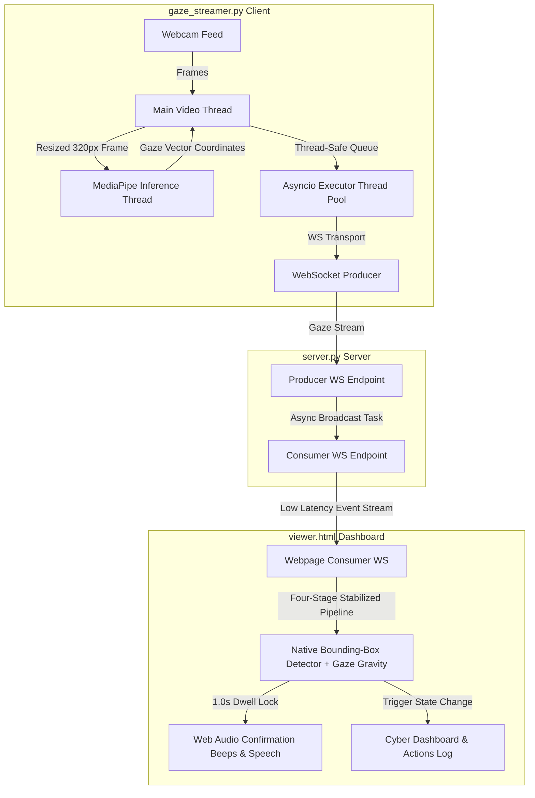

# Drishti (দৃষ্টি) - Predictive Gaze-Typing in Bengali 👁️⌨️

[](https://www.gnu.org/licenses/gpl-3.0)
[](#)
[](#)
[](#)

Drishti is a low-cost, software-based Augmentative and Alternative Communication (AAC) web interface built natively for the Bengali language. It allows users with severe motor disabilities (such as ALS or cerebral palsy) to type and communicate using only their eye movements and a standard 1080p webcam.

This project was developed as a final-year thesis/project (CSE 400) at the Department of Computer Science and Engineering, BRAC University.

---

## 📖 Table of Contents
- [About the Project](#about-the-project)
- [Key Features](#key-features)
- [Tech Stack](#tech-stack)
- [System Architecture](#system-architecture)
- [Current Status](#current-status)
- [Latency & Performance Optimization](#latency--performance-optimization)
- [Getting Started](#getting-started)
- [Usage & Interaction](#usage--interaction)
- [License](#license)
- [Acknowledgments](#acknowledgments)

---

## 🎯 About the Project
Assistive technology is often prohibitively expensive (costing upwards of $1,000 for infrared eye-trackers) and heavily optimized for the English language. This creates a massive accessibility barrier in Bangladesh.

**Drishti** bridges this gap by utilizing deep learning-based facial landmark detection via a standard 2D webcam to calculate 3D gaze vectors in real-time. To mitigate eye fatigue, it integrates a custom Bengali Natural Language Processing (NLP) predictive text engine that anticipates subsequent words and syllables, drastically reducing the physical effort required by the user.

---

## ✨ Key Features
* **Hardware Agnostic Gaze Tracking:** Works on standard consumer webcams without requiring expensive infrared sensors.
* **Three-Column Dashboard UI & Side Panels:** Utilizes screen margins to render a left Gaze Telemetry panel (real-time coordinates, dynamic alpha, hovered target) and a 2D Gaze Path canvas minimap (fading visual coordinates trail of last 15 points) alongside a right Quick-Speak presets panel for emergency Bengali voice synthesis.
* **Avro-Style Phonetic QWERTY Layout:** A fully integrated phonetic typing system that transliterates English keyboard inputs to Bengali Unicode in real-time (e.g. `ami` -> `আমি`), featuring conjunct (যুক্তবর্ণ) conjoining, an active word-in-progress underline style, a gaze-interactive `Shift` key for capitalization, and layout switcher buttons.
* **Semantic Language Augmentation:** Integrates a local `LaBSE` (Language-Agnostic BERT Sentence Embedding) dense encoder with an in-memory `Qdrant` vector database client on the backend to perform context-aware semantic sentence completions (e.g., `ami b` -> `আমি ভালো আছি`). Full-sentence intents are displayed in a dedicated deep purple glassmorphic "Semantic Bar" below the predictive chips, and are committed and spoken instantly via TTS upon a 1.0s dwell.
* **Ergonomic Bengali AAC Keyboard:** A high-contrast, phonon-frequency optimized virtual keyboard built into `viewer.html` featuring vowel, consonant, and dedicated tactile action rows (Backspace, Clear, Space, Speak) designed for ease of gaze targeting.
* **Context-Aware Predictive NLP Engine:** A local JavaScript N-gram predictive text engine offering prefix autocomplete and next-word recommendations (bigrams) based on a Bengali text corpus, drastically reducing the physical effort needed to type.
* **Four-Stage Ultra-Stabilized Gaze Precision Pipeline:** A premium multi-phase processing pipeline combining Python-side pre-filtering, boundary expansion, magnetic target snapping (Gaze Gravity), and a Quartic Adaptive EMA filter for lag-free, jitter-free precision.
* **Mathematical Head-Pose & Scale Invariance:** Normalizes raw iris coordinates relative to left/right eye socket corners and divides by socket width to eliminate tracking drift caused by head movement, tilts, or changes in distance.
* **Bengali Text-To-Speech (TTS):** Integrated Web Speech API support to speak the typed Bengali text buffer aloud with robust native voice lookup fallbacks.
* **Asynchronous Multi-Threaded Streaming:** Decoupled network and hardware operations enabling sub-30ms real-time transmission, bypassing Python's GIL bottlenecks with zero idle CPU utilization.
* **Premium Audio-Visual Dwell Indicators:** Animated circular SVG dwell indicators with custom sci-fi Web Audio feedback and live diagnostic scrolling logs.

---

## 🛠️ Tech Stack
* **Frontend:** HTML5, Vanilla CSS3 (Glassmorphism design, hardware-accelerated slide-up panels), JavaScript (ES6+), Web Audio API, Web Speech API (Bengali TTS)
* **Backend:** Python 3.12, FastAPI, WebSockets (Uvicorn HTTP server), `sentence-transformers` (`LaBSE` dense embeddings model), `qdrant-client` (in-memory mode vector DB)
* **Computer Vision:** OpenCV, Google MediaPipe (Face Landmarker & Iris Landmark Detection)
* **Machine Learning / NLP:** Local `LaBSE` dense encoder coupled with an in-memory `Qdrant` vector database client on the backend; local JavaScript Bengali N-gram predictive engine trained on Bengali corpus associations on the frontend

---

## 🧩 System Architecture

Drishti relies on a fully decoupled, multi-threaded communication topology to offload network transmission and video frames processing concurrently, bypassing the Python Global Interpreter Lock (GIL) bottlenecks:



---

## 👁️ Four-Stage Ultra-Stabilized Gaze Precision Pipeline

To achieve complete visual stability, perfect edge reach, and zero-tremble target snapping, Drishti processes gaze coordinates through a professional four-stage pipeline:

```
  [ Raw Coordinates ] 
          │
          ▼
┌───────────────────────────────────┐
│ 1. Pre-stabilization (Python)     │ ──► Smooths high-frequency sensor noise using
│    Alpha_Gaze = 0.09              │     an Exponential Moving Average (filters 91% noise)
└───────────────────────────────────┘
          │
          ▼
┌───────────────────────────────────┐
│ 2. Boundary-Expansion (JS)        │ ──► Scales raw coordinates relative to center (0.5)
│    Sensitivity = 1.12             │     by 1.12x for easy peripheral key targeting
└───────────────────────────────────┘
          │
          ▼
┌───────────────────────────────────┐
│ 3. Gaze Gravity Snapping (JS)     │ ──► Blends cursor coordinates 30% toward the
│    Magnetic Target Snapping       │     exact center of focused keys/interactive cards
└───────────────────────────────────┘
          │
          ▼
┌───────────────────────────────────┐
│ 4. Quartic Adaptive EMA (JS)      │ ──► Compiles velocity-driven quartic smoothing:
│    Alpha_Min = 0.003, Max = 0.07  │     locks cursor on targets; glides calmly on sweeps
└───────────────────────────────────┘
          │
          ▼
  [ Premium Cursor Glide ]
```

### 1. Pre-stabilization (Python Backend)
In `gaze_streamer.py`, the raw relative gaze coordinates derived from eye corners are smoothed before transmission:
* **Smoothing Factor ($\alpha_{gaze}$)**: Set to `0.09`.
* **Impact**: Filters out 91% of high-frequency camera sensor noise, delivering a highly stabilized coordinate stream to the frontend WebSocket.

### 2. Peripheral Boundary-Expansion (JavaScript Frontend)
Before applying precision filters, coordinates are scaled relative to the center ($0.5$):
* **Sensitivity Multiplier**: Increased to `1.12` for both X and Y axes.
* **Impact**: Reaching outermost keys (such as `অ`, `ক`, `মুছুন`, or `কথা বলুন`) requires only minimal, comfortable eye rotation, reducing physical muscle fatigue.

### 3. Gaze Gravity & Magnetic Target Snapping (JavaScript Frontend)
To prevent the cursor from drifting or sliding off keys during target fixation, we implemented an advanced **gaze gravity** system:
* **Snapping Mechanic**: When the cursor enters the boundaries of any interactive key or card, the system blends the coordinates $30\%$ toward the exact geometric center of that element:
  $$x_{target} = x_{scaled} \cdot 0.70 + x_{elem\_center} \cdot 0.30$$
  $$y_{target} = y_{scaled} \cdot 0.70 + y_{elem\_center} \cdot 0.30$$
* **Impact**: The cursor mathematically "locks" into the center of the key, providing absolute target precision and facilitating comfortable, reliable dwell-activation.

### 4. Quartic Adaptive EMA Filter (JavaScript Frontend)
Magnetically snapped coordinates are then filtered to eliminate physiological micro-saccadic jitter and ensure a premium, cinematic glide:
* **Velocity Tracking**: Euclidean distance $d$ is tracked relative to the previous cursor location.
* **Quartic Velocity Scaling**: Maps $d$ against a dead-zone threshold $d_{thresh} = 0.28$ using a 4th-power curve:
  $$\alpha = \alpha_{min} + (\alpha_{max} - \alpha_{min}) \cdot \text{clamp}\left(\left(\frac{d}{d_{thresh}}\right)^4, 0, 1\right)$$
* **Tuned Constants**:
  * **$\alpha_{min} = 0.003$ (Target Fixation)**: Once focus is established, the coordinate updates at only $0.3\%$ per frame, holding the cursor completely stationary.
  * **$\alpha_{max} = 0.07$ (Dynamic Sweep)**: Capped at $7\%$ to force a slow, elegant, and predictable sweep glide.
  * **$d_{thresh} = 0.28$**: Dead-zone threshold tuned to absorb high-frequency tremors while maintaining deliberate sweep responsiveness.

---

## ⚡ Latency & Performance Optimization

To deliver absolute real-time snappiness and eliminate communication lag, Drishti incorporates **7 critical optimizations**:

1. **GIL Contention Queue Offloading:** The WebSocket sender worker uses `loop.run_in_executor(None, ws_queue.get)` to block on the queue in a thread pool. This replaces expensive tight CPU polling with a 100% event-driven async structure, dropping sender thread CPU utilization to **0% when idle** and freeing the GIL.
2. **Deepcopy Thread Isolation:** Upgraded thread communication in `gaze_streamer.py` using `copy.deepcopy()` under thread safety locks. This isolates nested calibration structures across main loop and MediaPipe threads, preventing concurrent modification exceptions.
3. **Scaled Down Inference Frame Size:** Camera frames are scaled to `INFER_WIDTH = 320` for MediaPipe. Processing 4x fewer pixels speeds up face landmarking by 3-4x (slashing inference latency to **~12ms** per frame) while retaining full iris detail.
4. **Transition-Free Visual Snap:** Removed CSS transitions from the browser cursor `#dot` (`transition: none`). The dot snaps instantaneously to raw gaze coordinates as they arrive, matching native OS mouse behavior.
5. **waitKey Delay Minimization:** OpenCV keyboard polling was optimized from `cv2.waitKey(5)` to `cv2.waitKey(1)` to save 4ms of blocking time per frame.
6. **Robust Head-Pose & Scale Invariance:** Replaced absolute coordinates with relative displacement vectors anchored to eye corner landmarks ($L_{33}, L_{133}, R_{263}, R_{362}$). Dividing the relative offset by Euclidean eye socket width makes coordinates fully scale-invariant and translation-invariant.
7. **Crash-Resistant Collision Mapping:** Upgraded the collision detection to dynamically resolve dynamic button text and classes safely without throwing exceptions on generic HTML structures.

---

## 🧩 Current Status
* **Core eye-tracking and calibration:** Implemented in `eye_tracker.py` using MediaPipe Tasks Face Landmarker, fully calibrated using relative eye corner offset vectors.
* **Decoupled network streaming pipeline:** Fully established in `gaze_streamer.py` and `server.py` with asynchronous multi-threaded offloading and deepcopy safety.
* **Semantic Language Augmentation:** Fully integrated in the backend (`server.py`) and frontend (`viewer.html`). Uses a local `LaBSE` dense encoder and in-memory `Qdrant` vector database client to provide real-time context-aware Bengali sentence suggestions from a conversational/emergency corpus.
* **Three-Column Cyber-Dashboard UI:** Fully integrated into `viewer.html` containing:
  - Left panel: Telemetry indicators and HTML5 `<canvas>` Gaze Path minimap visualizer (last 15 points trail).
  - Right panel: Urgent Quick-Speak preset cards (help, water, hungry, etc.) playing Bengali speech synthesis upon 1.0s dwell.
  - Dual-layout virtual keyboard: Swaps between Phonetic QWERTY (Avro-style) and Direct Bangla vowel/consonant grids via gaze.
  - Dedicated "Semantic Bar" (deep purple glassmorphic style) rendering top sentence suggestions, committing and speaking the suggestion via TTS instantly upon 1.0s dwell.
  - Active word-in-progress visualizer (dashed cyan underline) and realtime autocomplete predictions.
  - Cyber-terminal logs, Web Audio sound tones, and responsive `@media` query fallbacks.

---

## 🚀 Getting Started

### Prerequisites
* [Python 3.12](https://www.python.org/downloads/)
* A working 1080p/720p webcam

### 1. Setup Virtual Environment
Create and activate a Python virtual environment:

```powershell
python -m venv .venv
Set-ExecutionPolicy -ExecutionPolicy RemoteSigned -Scope Process -Force
.\.venv\Scripts\Activate.ps1
pip install -r requirements.txt
```

### 2. Download Face Landmarker Model
Create a directory and download the required Google MediaPipe model task:

```powershell
New-Item -ItemType Directory -Force -Path .\models | Out-Null
Invoke-WebRequest -Uri "https://storage.googleapis.com/mediapipe-models/face_landmarker/face_landmarker/float16/latest/face_landmarker.task" -OutFile ".\models\face_landmarker.task"
```

---

## 🖱️ Usage & Interaction

To test the hands-free interactive gaze PoC, you must run the server, open the browser UI, and start streaming coordinates:

### 1. Start the FastAPI WebSocket Server
```powershell
.\.venv\Scripts\Activate.ps1
uvicorn server:app --host 127.0.0.1 --port 8000
```

### 2. Open the Browser UI
Open the [viewer.html](viewer.html) file directly in your browser. (Reload with **Ctrl + F5** to clear any cached assets).

### 3. Run the Multi-Threaded Gaze Streamer
Open a new terminal/command prompt and start coordinate transmission:
```powershell
.\.venv\Scripts\Activate.ps1
python gaze_streamer.py
```

### 4. Calibration & Hands-Free Interaction
1. **Calibration**: Keep your head steady. Focus your eyes on the yellow circular targets as they appear on the OpenCV screen. The progress ring fills as coordinates are calibrated.
2. **Gaze Tracking**: Once calibrated, the browser UI will switch status to **TRACKING ACTIVE**. Move your eyes to control the cursor.
3. **Dwell Selection**: Hover the green coordinate dot over any of the four glassmorphic cards for **1 second**:
   - The SVG circle around the cursor will animate clockwise.
   - You will hear a soft lock tone.
   - Upon completion, the element will flash with a sound chirp, trigger its state, and log the event in the cyber-terminal at the bottom of the page!
4. **Hotkeys**: Press `r` in the camera preview to recalibrate, and `q` to quit.

---

## 📜 License
This project is free and open-source software distributed under the GNU General Public License v3.0 (GPLv3). See the LICENSE file for more details.

---

## 🙏 Acknowledgments
* Google MediaPipe & OpenCV open-source communities.
* CSE Department, BRAC University.