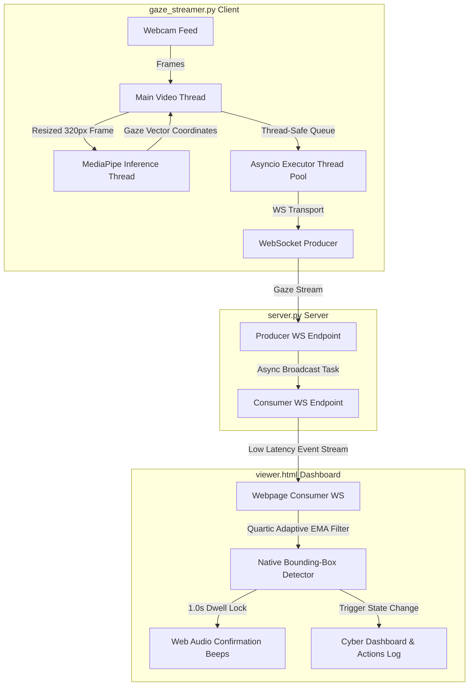

# Drishti (দৃষ্টি) - Predictive Gaze-Typing in Bengali 👁️⌨️

[](https://www.gnu.org/licenses/gpl-3.0)
[](#)
[](#)
[](#)

Drishti is a low-cost, software-based Augmentative and Alternative Communication (AAC) web interface built natively for the Bengali language. It allows users with severe motor disabilities (such as ALS or cerebral palsy) to type and communicate using only their eye movements and a standard 1080p webcam.

This project was developed as a final-year thesis/project (CSE 400) at the Department of Computer Science and Engineering, BRAC University.

---

## 📖 Table of Contents
- [About the Project](#about-the-project)
- [Key Features](#key-features)
- [Tech Stack](#tech-stack)
- [System Architecture](#system-architecture)
- [Current Status](#current-status)
- [Latency & Performance Optimization](#latency--performance-optimization)
- [Getting Started](#getting-started)
- [Usage & Interaction](#usage--interaction)
- [License](#license)
- [Acknowledgments](#acknowledgments)

---

## 🎯 About the Project
Assistive technology is often prohibitively expensive (costing upwards of $1,000 for infrared eye-trackers) and heavily optimized for the English language. This creates a massive accessibility barrier in Bangladesh.

**Drishti** bridges this gap by utilizing deep learning-based facial landmark detection via a standard 2D webcam to calculate 3D gaze vectors in real-time. To mitigate eye fatigue, it integrates a custom Bengali Natural Language Processing (NLP) predictive text engine that anticipates subsequent words and syllables, drastically reducing the physical effort required by the user.

---

## ✨ Key Features
* **Hardware Agnostic Gaze Tracking:** Works on standard consumer webcams without requiring expensive infrared sensors.
* **Ergonomic Bengali UI:** A high-contrast virtual keyboard optimized for "dwell-clicking" (staring at a key for a set duration to click).
* **Predictive Bengali Text Engine:** Context-aware word prediction trained on a Bengali corpus to minimize keystrokes.
* **Asynchronous Multi-Threaded streaming:** Decoupled network and hardware operations to enable sub-30ms real-time transmission.
* **Hands-free Gaze Interaction:** Animated circular SVG dwell indicators with integrated sci-fi sound feedback and scrolling live event logs.
* **Quartic Adaptive Gaze Stabilization:** A mathematical 4th-power adaptive Exponential Moving Average (EMA) filter that isolates physiological micro-saccades and tremors during target fixation while retaining instant saccadic sweep responsiveness.
* **Mathematical Head-Pose & Scale Invariance:** Normalizes raw iris coordinates relative to the outer/inner corners of both eye sockets and scales them by eye width. This eliminates tracking drift caused by head movements (translation/tilts) or changing webcam distances.

---

## 🛠️ Tech Stack
* **Frontend:** HTML5, Vanilla CSS3 (Glassmorphic visual styling), JavaScript (ES6+), Web Audio API
* **Backend:** Python 3.12, FastAPI, WebSockets (Uvicorn HTTP server)
* **Computer Vision:** OpenCV, Google MediaPipe (Face Landmarker & Iris Landmark Detection)
* **Machine Learning / NLP:** PyTorch, NLTK, Bangla2B Corpus

---

## 🧩 System Architecture

Drishti relies on a fully decoupled, multi-threaded communication topology to offload network transmission and video frames processing concurrently, bypassing the Python Global Interpreter Lock (GIL) bottlenecks:



---

## ⚡ Latency & Performance Optimization

To deliver absolute real-time snappiness and eliminate communication lag, Drishti incorporates **5 critical optimizations**:

1. **GIL Contention Queue Offloading:** The WebSocket sender worker uses `loop.run_in_executor(None, ws_queue.get)` to block on the queue in a thread pool. This replaces expensive tight CPU polling with a 100% event-driven async structure, dropping sender thread CPU utilization to **0% when idle** and freeing the GIL.
2. **Deepcopy Overhead Elimination:** Replaced CPU-expensive `copy.deepcopy()` operations with lightweight dictionary shallow copies (`shared_state.copy()`) on the high-frequency camera frame loops.
3. **Scaled Down Inference Frame Size:** Camera frames are scaled to `INFER_WIDTH = 320` for MediaPipe. Processing 4x fewer pixels speeds up face landmarking by 3-4x (slashing inference latency to **~12ms** per frame) while retaining full iris detail.
4. **Transition-Free Visual Snap:** Removed CSS transitions from the browser cursor `#dot` (`transition: none`). The dot snaps instantaneously to raw gaze coordinates as they arrive, matching native OS mouse behavior.
5. **waitKey Delay Minimization:** OpenCV keyboard polling was optimized from `cv2.waitKey(5)` to `cv2.waitKey(1)` to save 4ms of blocking time per frame.
6. **Quartic Adaptive Dead-Zone Filtering:** Combats natural high-frequency physiological eye-jitter (tremors) by applying a $4^{\text{th}}\text{-power}$ adaptive Exponential Moving Average (EMA) algorithm on the coordinate data. It locks the gaze cursor steady during static fixation ($\alpha_{\text{min}} = 0.015, d_{\text{thresh}} = 0.12$) and transitions to near-raw coordinates ($\alpha_{\text{max}} = 0.95$) during saccades for lag-free cursor tracking.
7. **Relative Eye-Corner Displacement Vectors:** Gaze tracking is traditionally highly susceptible to head drift. We replaced absolute normalized camera coordinate tracking with relative displacement vectors anchored to eye corner landmarks ($L_{33}, L_{133}, R_{263}, R_{362}$). By dividing relative iris offset by Euclidean eye socket width, the raw coordinates sent to the calibration mapping are fully scale-invariant and translation-invariant.

---

## 🧩 Current Status
* **Core eye-tracking and calibration:** Implemented in `eye_tracker.py` using MediaPipe Tasks Face Landmarker.
* **Decoupled network streaming pipeline:** Fully established in `gaze_streamer.py` and `server.py` with asynchronous multi-threaded offloading.
* **Hands-free Interactive Cyber-Dashboard:** Integrated into `viewer.html` containing an SVG circular loading ring, responsive glassmorphic cards (Smart Lights, Sound System, Padlock Alert, Gaze Recalibration), Web Audio beep feedback, and a scrolling live cyber-terminal log.

---

## 🚀 Getting Started

### Prerequisites
* [Python 3.12](https://www.python.org/downloads/)
* A working 1080p/720p webcam

### 1. Setup Virtual Environment
Create and activate a Python virtual environment:

```powershell
python -m venv .venv
Set-ExecutionPolicy -ExecutionPolicy RemoteSigned -Scope Process -Force
.\.venv\Scripts\Activate.ps1
pip install -r requirements.txt
```

### 2. Download Face Landmarker Model
Create a directory and download the required Google MediaPipe model task:

```powershell
New-Item -ItemType Directory -Force -Path .\models | Out-Null
Invoke-WebRequest -Uri "https://storage.googleapis.com/mediapipe-models/face_landmarker/face_landmarker/float16/latest/face_landmarker.task" -OutFile ".\models\face_landmarker.task"
```

---

## 🖱️ Usage & Interaction

To test the hands-free interactive gaze PoC, you must run the server, open the browser UI, and start streaming coordinates:

### 1. Start the FastAPI WebSocket Server
```powershell
.\.venv\Scripts\Activate.ps1
uvicorn server:app --host 127.0.0.1 --port 8000
```

### 2. Open the Browser UI
Open the [viewer.html](viewer.html) file directly in your browser. (Reload with **Ctrl + F5** to clear any cached assets).

### 3. Run the Multi-Threaded Gaze Streamer
Open a new terminal/command prompt and start coordinate transmission:
```powershell
.\.venv\Scripts\Activate.ps1
python gaze_streamer.py
```

### 4. Calibration & Hands-Free Interaction
1. **Calibration**: Keep your head steady. Focus your eyes on the yellow circular targets as they appear on the OpenCV screen. The progress ring fills as coordinates are calibrated.
2. **Gaze Tracking**: Once calibrated, the browser UI will switch status to **TRACKING ACTIVE**. Move your eyes to control the cursor.
3. **Dwell Selection**: Hover the green coordinate dot over any of the four glassmorphic cards for **1 second**:
   - The SVG circle around the cursor will animate clockwise.
   - You will hear a soft lock tone.
   - Upon completion, the element will flash with a sound chirp, trigger its state, and log the event in the cyber-terminal at the bottom of the page!
4. **Hotkeys**: Press `r` in the camera preview to recalibrate, and `q` to quit.

---

## 📜 License
This project is free and open-source software distributed under the GNU General Public License v3.0 (GPLv3). See the LICENSE file for more details.

---

## 🙏 Acknowledgments
* Google MediaPipe & OpenCV open-source communities.
* CSE Department, BRAC University.