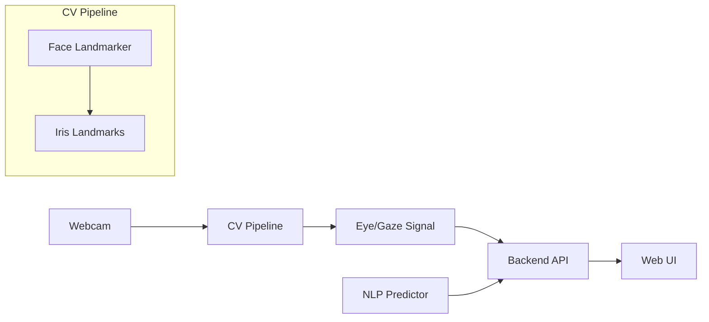

# Drishti (দৃষ্টি) - Predictive Gaze-Typing in Bengali 👁️⌨️

[](https://www.gnu.org/licenses/gpl-3.0)
[](#)
[](#)
[](#)

Drishti is a low-cost, software-based Augmentative and Alternative Communication (AAC) web interface built natively for the Bengali language. It allows users with severe motor disabilities (such as ALS or cerebral palsy) to type and communicate using only their eye movements and a standard 1080p webcam.

This project was developed as a final-year thesis/project (CSE 400) at the Department of Computer Science and Engineering, BRAC University.

## 📖 Table of Contents
- [About the Project](#about-the-project)
- [Key Features](#key-features)
- [Tech Stack](#tech-stack)
- [System Architecture](#system-architecture)
- [Current Status](#current-status)
- [Roadmap](#roadmap)
- [Getting Started](#getting-started)
- [Usage](#usage)
- [License](#license)
- [Acknowledgments](#acknowledgments)

---

## 🎯 About the Project
Assistive technology is often prohibitively expensive (costing upwards of $1,000 for infrared eye-trackers) and heavily optimized for the English language. This creates a massive accessibility barrier in Bangladesh.

**Drishti** bridges this gap by utilizing deep learning-based facial landmark detection via a standard 2D webcam to calculate 3D gaze vectors in real-time. To mitigate eye fatigue, it integrates a custom Bengali Natural Language Processing (NLP) predictive text engine that anticipates subsequent words and syllables, drastically reducing the physical effort required by the user.

## ✨ Key Features
* **Hardware Agnostic Gaze Tracking:** Works on standard consumer webcams without requiring expensive infrared sensors.
* **Ergonomic Bengali UI:** A high-contrast virtual keyboard optimized for "dwell-clicking" (staring at a key for a set duration to click).
* **Predictive Bengali Text Engine:** Context-aware word prediction trained on a Bengali corpus to minimize keystrokes.
* **Ultra-Low Latency:** Utilizes WebSockets for real-time cursor updates between the ML backend and the browser.

## 🛠️ Tech Stack
* **Frontend:** React.js, Tailwind CSS, Zustand (State Management)
* **Backend:** Python, FastAPI, WebSockets
* **Computer Vision:** OpenCV, Google MediaPipe (Face Landmarker / Iris Tracking)
* **Machine Learning / NLP:** PyTorch, NLTK, Bangla2B Corpus

## 🧩 System Architecture


## Current Status
- This repository currently contains the eye-tracking proof of concept only.
- Implemented in [eye_tracker.py](eye_tracker.py) using MediaPipe Tasks Face Landmarker.
- UI, NLP, and backend services are planned but not yet in this repo.

## Roadmap
- Stable gaze estimation and calibration flow
- FastAPI WebSocket backend for real-time cursor updates
- React-based Bengali keyboard with dwell-click UX
- Bengali predictive text engine integration
- End-to-end latency and accessibility testing

## 🚀 Getting Started

### Prerequisites
* [Python 3.12](https://www.python.org/downloads/)
* A working webcam

### 1. Backend Setup (Computer Vision & ML)
Create and activate a Python virtual environment:

```powershell
python -m venv .venv
Set-ExecutionPolicy -ExecutionPolicy RemoteSigned -Scope Process -Force
.\.venv\Scripts\Activate.ps1
pip install opencv-python mediapipe
```

Download the Face Landmarker model file:

```powershell
New-Item -ItemType Directory -Force -Path .\models | Out-Null
Invoke-WebRequest -Uri "https://storage.googleapis.com/mediapipe-models/face_landmarker/face_landmarker/float16/latest/face_landmarker.task" -OutFile ".\models\face_landmarker.task"
```

### 2. Run the Eye-Tracking PoC

```powershell
.\.venv\Scripts\Activate.ps1
python eye_tracker.py
```

Press `q` to exit the camera window.

## 🖱️ Usage
Ensure your room is well-lit and your face is clearly visible to the webcam.

Keep your head relatively still. Look at a specific point on the screen to see iris landmarks drawn in real time.

## 📜 License
This project is free and open-source software distributed under the GNU General Public License v3.0 (GPLv3). See the LICENSE file for more details.

## 🙏 Acknowledgments
- MediaPipe and OpenCV open-source communities